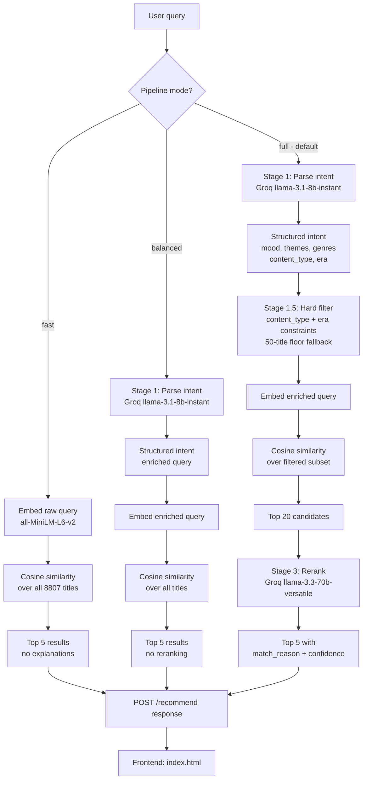
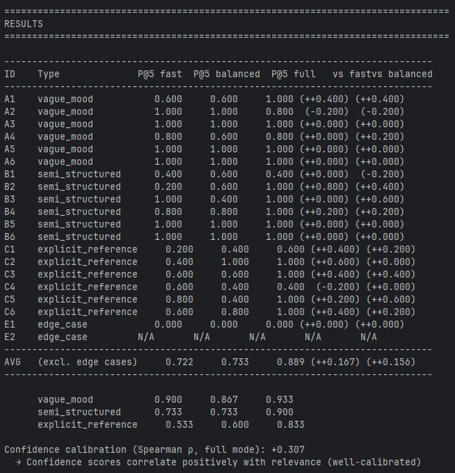

# Movie Recommender

Semantic movie recommendation over the Netflix catalog. A natural language query goes through up to three stages: an LLM parses it into structured intent, a local embedding model retrieves the closest matches, and a second LLM reranks them with explicit reasoning. Three pipeline modes let you trade response speed for recommendation quality.

---

## Table of Contents

1. [Setup](#setup)
2. [AI Setup](#ai-setup)
3. [Architecture](#architecture)
4. [Approach](#approach)
5. [Design Tradeoffs](#design-tradeoffs)
6. [Evaluation](#evaluation)
7. [Demo](#demo)
8. [If This Were Telo](#if-this-were-telo)

---

## Setup

### Prerequisites

- [Docker](https://www.docker.com/) installed and running
- A free Groq API key from [console.groq.com](https://console.groq.com)

### Step 1: Configure environment

```bash
cp .env.example .env
```

Open `.env` and add your Groq API key:

```
GROQ_API_KEY=your_groq_api_key_here
```

### Step 2: Build and run

```bash
docker build -t movie-recommender .
docker run -p 8080:80 movie-recommender
```

Open [http://localhost:8080](http://localhost:8080) in your browser.

> The Docker build downloads the sentence-transformers model (~80 MB) and pre-computes embeddings for all 8,807 titles during `docker build`. This takes a few minutes on first run but is fully cached on subsequent builds unless the data or dependencies change. The container itself boots in under 10 seconds.

### Running locally (without Docker)

```bash
pip install -r requirements.txt
python scripts/precompute.py   # run once to generate embeddings
uvicorn backend.main:app --host 0.0.0.0 --port 8080 --reload
```

### API

| Method | Endpoint | Description |
|--------|----------|-------------|
| `GET` | `/health` | Returns server status and number of titles loaded |
| `POST` | `/recommend` | Accepts a query and returns ranked recommendations |
| `GET` | `/` | Serves the frontend UI |

**POST /recommend request body:**

```json
{
  "query": "something dark and atmospheric",
  "pipeline_mode": "full"
}
```

`pipeline_mode` accepts `"fast"`, `"balanced"`, or `"full"` (default: `"full"`).

**Response:**

```json
{
  "query": "something dark and atmospheric",
  "interpreted_as": {
    "mood": "dark",
    "themes": ["atmosphere", "dread", "tension"],
    "genres": ["Thrillers", "Horror Movies"],
    "content_type": null,
    "era_preference": null,
    "enriched_query": "dark atmospheric psychological thriller dread slow burn suspense"
  },
  "recommendations": [
    {
      "title": "Midnight Mass",
      "type": "TV Show",
      "genres": ["TV Horror", "TV Dramas", "TV Mysteries"],
      "description": "...",
      "release_year": 2021,
      "match_reason": "A slow-burn horror series drenched in religious dread and atmospheric tension that lingers well after each episode.",
      "confidence": 0.93
    }
  ],
  "pipeline_used": "full"
}
```

Empty or whitespace-only queries return HTTP 422. LLM failures fall back gracefully and always return HTTP 200 with cosine-ranked results.

---

## AI Setup

| Component | Model | Provider | Runs where |
|-----------|-------|----------|------------|
| Query intent parsing | `llama-3.1-8b-instant` | Groq API | Remote |
| Result reranking | `llama-3.3-70b-versatile` | Groq API | Remote |
| Semantic embeddings | `all-MiniLM-L6-v2` | sentence-transformers | Local (CPU, no API key) |

The embedding model runs entirely on CPU inside the container. No GPU is required. The `GROQ_API_KEY` is only needed for the `balanced` and `full` pipeline modes. The `fast` mode runs with no API key and no external calls whatsoever.

Two model sizes, one per stage:

- **8b for parsing:** Structured JSON extraction from natural language. Speed matters here; the task is mechanical enough that a smaller model handles it reliably.
- **70b for reranking:** Evaluating thematic and emotional fit between a query and a list of candidates. This requires actual reasoning, so the larger model earns its latency cost.

---

## Architecture



**Data pipeline (two phases):**

Build time (runs once inside `docker build`):
```
netflix_data.csv  -->  scripts/precompute.py  -->  data/embeddings.npy       (8807 x 384, float32, ~13 MB)
                                               -->  data/titles_index.json    (metadata, index-aligned to embeddings)
```

Runtime (runs on every container boot, completes in under 10 seconds):
```
data/embeddings.npy      -->  loaded into RAM via FastAPI lifespan
data/titles_index.json   -->  loaded into RAM via FastAPI lifespan
all-MiniLM-L6-v2        -->  SentenceTransformer loaded from local cache
```

**Project structure:**

```
movie-recommender/
├── backend/
│   ├── config.py        Model names, paths, pipeline constants
│   ├── models.py        Pydantic request/response schemas
│   ├── filters.py       Pre-retrieval hard filtering on content type and era
│   ├── embedder.py      SentenceTransformer wrapper with top-k retrieval
│   ├── recommender.py   Three-stage pipeline orchestration
│   └── main.py          FastAPI app with lifespan loader and endpoints
├── scripts/
│   └── precompute.py    Offline embedding computation (run at Docker build time)
├── eval/
│   ├── test_queries.json  20 labeled queries across 4 types
│   ├── evaluate.py        Precision@5 comparison table across all modes
│   └── README.md
├── data/
│   ├── netflix_data.csv
│   ├── embeddings.npy      (generated)
│   └── titles_index.json   (generated)
├── frontend/
│   └── index.html
├── Dockerfile
├── requirements.txt
└── .env.example
```

---

## Approach

### Why three stages?

A raw cosine search over the user's literal query text works, but it has a hard ceiling. The embedding model does not know whether "something like Inception" means a sci-fi thriller, a heist movie, or a film about memory. It also cannot enforce "only TV shows from the 90s" without first extracting that constraint from the query. The three-stage pipeline addresses each limitation explicitly.

**Stage 1: Intent parsing**

`llama-3.1-8b-instant` reads the raw query and returns a structured JSON object containing:

- `mood`: the emotional register the user is looking for
- `themes`: thematic keywords (e.g. "betrayal", "survival", "identity")
- `genres`: matching catalog genres
- `content_type`: `"Movie"`, `"TV Show"`, or `null`
- `era_preference`: `"90s"`, `"2010s"`, `"recent"`, or `null`
- `enriched_query`: a rewritten, expanded query optimized for semantic search

If Stage 1 fails for any reason (API error, malformed JSON, timeout), the pipeline falls back to the raw query string and continues. No request ever fails because of an LLM error.

**Stage 1.5: Hard filtering**

Before cosine search runs, the embedding matrix is sliced to only titles that satisfy the `content_type` and `era_preference` constraints extracted in Stage 1. Filtering before retrieval rather than after is intentional: the cosine rankings are computed over a valid candidate set, so position 1 through 20 are all legitimate results rather than a mix of valid and invalid ones that need post-processing.

A 50-title floor is enforced. If the filters leave fewer than 50 titles (for example, "classic TV shows" on a dataset that skews recent), the constraints are silently relaxed and the full corpus is used instead.

**Stage 2: Cosine retrieval**

`all-MiniLM-L6-v2` encodes the enriched query into a 384-dimensional vector. A dot product against the pre-computed, normalized embedding matrix returns the top-20 most similar titles. Because the embeddings are normalized, dot product is equivalent to cosine similarity without the square root computation.

The top-20 pool exists to give the reranker enough variety to surface non-obvious matches. Fewer candidates and the reranker has nothing to work with. More candidates and the prompt grows too large for the model to reason effectively over.

**Stage 3: LLM reranking**

`llama-3.3-70b-versatile` reads the original query, the structured intent from Stage 1, and the top-20 cosine candidates. It selects and ranks the best 5, returning a one-sentence `match_reason` and a `confidence` score between 0.0 and 1.0 for each result.

A query like "movies like Parasite" does not match on genre tags alone. It matches on class anxiety, tonal dread, and genre-blending. That kind of judgment needs a model that can read subtext, not one that pattern-matches on metadata fields.

If Stage 3 fails, the system falls back to the cosine-ordered top 5 without explanations.

### Embedding text construction

Each title is embedded as a concatenation of its title, type, genre tags, description, director (if present), and the first four cast members (if present). Description carries the most semantic weight. Director and cast are included because some queries are talent-specific ("movies directed by Scorsese"), but both fields are frequently null in this dataset so they are conditionally appended.

### Pre-computation

Embedding 8,807 titles at query time would add roughly 15 seconds per request. All embeddings are computed once during `docker build` via `scripts/precompute.py` and stored as `data/embeddings.npy`. At startup, the app loads the numpy file and the aligned `titles_index.json` into memory. Cosine search at query time involves only a matrix-vector multiply with no model inference.

---

## Design Tradeoffs

### LLM reranker vs. cross-encoder

A cross-encoder such as `cross-encoder/ms-marco-MiniLM-L-6-v2` would score each query-candidate pair jointly and produce well-calibrated similarity scores. It is faster than an LLM call, runs locally, and requires no API key.

The LLM reranker was chosen for two reasons a cross-encoder cannot address:

1. **Explanations.** The `match_reason` field is not cosmetic. It is the mechanism by which a user understands why a result was returned, which is especially important for vague or mood-based queries where the connection is not obvious from genre tags alone.

2. **Thematic reasoning.** A cross-encoder measures textual similarity between the query and candidate description. An LLM can reason about whether a film's emotional register, social themes, or narrative structure fits what the user described, even when the surface text does not obviously match.

The cost is latency (approximately 2 to 3 seconds added per request in full mode) and Groq API usage. For a production system at scale, the right architecture would be a cross-encoder for initial coarse reranking followed by an LLM pass only for explanation generation. At this dataset size and request volume, the LLM-as-reranker approach is appropriate and demonstrates the design intent more clearly.

### Groq vs. other inference providers

Groq's inference speed (roughly 300 tokens per second for the 70b model) keeps the two-call full pipeline responsive. A slower provider would make the latency cost of the reranker feel unacceptable. The llama-3.x model family also performs reliably on structured JSON extraction tasks, which is the critical requirement for Stage 1.

### Pre-computed embeddings vs. a vector database

A vector database such as pgvector or Pinecone would enable incremental updates (add a title without recomputing all embeddings) and support filtering at the index level. For a static 8,807-title dataset that fits in RAM, a numpy matrix with a dot-product search is simpler, faster, and introduces no infrastructure dependency. If the catalog were larger or updated frequently, a vector database would be the right call.

### Baking the .env into the Docker image

The API key is copied into the image at build time rather than injected at runtime via environment variable flags. This satisfies the two-command run requirement (no `-e` flags on `docker run`). For a production deployment, secrets would be managed via a secrets manager or injected at runtime through the orchestration layer, not baked into the image.

---

## Evaluation

### Running the suite

Start the server, then run:

```bash
python eval/evaluate.py
```

The script runs all 20 test queries across all three pipeline modes and prints a comparison table.

```
python eval/evaluate.py --url http://localhost:8080   # custom server URL
python eval/evaluate.py --mode full                   # single mode only
python eval/evaluate.py --timeout 60                  # per-request timeout
```

### Query set

| Type | Count | Description |
|------|-------|-------------|
| `vague_mood` | 6 | No explicit genre, e.g. "something unsettling that stays with you" |
| `semi_structured` | 6 | Partial constraints, e.g. "dark comedy from the 2010s" |
| `explicit_reference` | 6 | Reference-based, e.g. "movies like Inception" |
| `edge_case` | 2 | Gibberish input and whitespace-only input |

### Scoring

**Precision@5:** Fraction of top-5 results that score 1 or higher on the graded relevance scale.

- **2 (strong match):** Returned genre directly matches the query's expected tone
- **1 (weak match):** Returned genre is plausible but not ideal
- **0 (miss):** Returned genre is irrelevant or contradicts the query

**Confidence calibration (full mode only):** Spearman rank correlation between the reranker's confidence scores and graded relevance scores. A positive correlation indicates the model assigns higher confidence when it is actually correct.

Edge cases are excluded from aggregate averages.

### Results

> 
---

## Demo

> https://github.com/user-attachments/assets/fb5475cd-0589-4f1d-aa04-7afcb4bdc457


Sample queries to try:

| Query | Tests |
|-------|-------|
| `something unsettling that stays with you` | Vague mood, no explicit genre |
| `dark comedy from the 2010s` | Era filter + tone constraint |
| `Korean drama with romance` | International + genre |
| `movies like Inception` | Reference-based retrieval |
| `more shows like Squid Game` | Content type inference |
| `crime documentaries about real cases` | Format distinction (documentary vs fictional) |
| `a movie my dad would like, he loves Clint Eastwood` | Talent-specific, cast embeddings |

---

## If This Were Telo

The shape of the problem here is the same as what Telo is solving: take a vague human brief, extract what it actually means, and return a ranked shortlist with reasons. The inputs are fuzzier for venues ("I want a rooftop with a good vibe for 40 people"), the catalog is curated rather than open, and a bad match costs more than a wasted Netflix session. But the pipeline structure maps directly.

A few things I would approach differently in that context:

**Hard filters are not optional.** In this system, the 50-title floor exists because "classic sci-fi TV shows" is an underspecified query on a mostly-modern dataset, and it is better to widen than to return nothing. For venues, capacity is a hard constraint. Routing a 200-person event to a 60-seat space is not a degraded result, it is a broken product. The filter logic would need to treat headcount, date availability, and budget as strict gates rather than soft preferences.

**The explanation is the deliverable.** The `match_reason` field in this system is a nice-to-have. For a client receiving a venue shortlist, it is the thing they read. Why this space, for this brief, at this size. The LLM's output shifts from being a ranking signal to being the actual content that gets sent to the client. That changes how you prompt it and what you evaluate.

**Calibration matters more than ranking.** A well-calibrated confidence score lets the system know when to say "here are three strong options" versus "the brief is too vague to return anything with conviction." The Spearman check in the eval suite is a rough proxy for this. For Telo, the real calibration signal would come from outcome data: did the client book? Did they come back? Genre precision can tell you if the retrieval is pointed in the right direction. Only downstream outcomes tell you if the match was actually good.

**You need feedback before you can improve.** The eval suite here runs against genre labels I defined manually. That works for checking the pipeline is sensible, but it does not improve with use. For Telo, wiring booking outcomes and venue feedback back into the system is what makes it get better over time rather than staying static.
